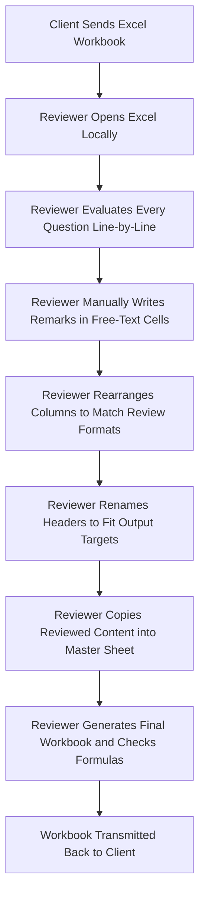
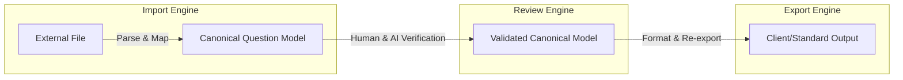

# Project Knowledge: QuestionBankQA

This document serves as the central knowledge base for the **QuestionBankQA** project. It translates domain experiences, lessons learned, and core architectural concepts into a reference specification for engineers and automated agents working on the repository.

---

## 1. Project Background

The QuestionBankQA project was initiated after an extensive manual QA exercise involving approximately one hundred multiple-choice questions (MCQs) supplied in Microsoft Office formats. During this process, several critical inefficiencies were identified:
*   Reviewers spent excessive time dealing with file layout differences rather than evaluating content quality.
*   Data cleanup, correction of keys, and formatting was performed directly within spreadsheets.
*   Manual edits frequently introduced copy-paste errors and broken cell references.

QuestionBankQA was conceived to replace this manual, spreadsheet-centric workflow with a structured, software-driven QA environment that automates file parsing, applies consistent quality checks, and exports data cleanly back to the client.

---

## 2. Existing Manual Workflow

The baseline process that this software targets is defined by the following sequential operations:

### Pain Points of the Manual Workflow
*   **High Cognitive Load**: Evaluating question accuracy, distractor validity, and formatting rules directly inside dense Excel grids leads to fatigue and missed errors.
*   **Vulnerability to Copy-Paste Errors**: Manually consolidating rows and copy-pasting corrected text between sheets often introduces silent data corruption.
*   **Inconsistent Comment Quality**: Remarks and issue descriptions are written in free-text columns without standardized categories, making it hard for authors to parse feedback.
*   **Time-Consuming Structural Changes**: Rearranging, renaming, and re-sorting columns to fit internal vs. client formats consumes hours of manual work.
*   **Lack of Audit Trail**: There is no historical log of who reviewed a question, when a change was made, or what the original input looked like.

---

## 3. Lessons Learned

Through real-world operations, several key constraints have been established:
*   **Format Inconsistency**: Every client utilizes a unique Excel spreadsheet format. Column headers differ (e.g., `Question`, `Question Text`, `Item Stem`, `Stem`), as do column positions and cell styles.
*   **Schema Volatility**: Even within the same client project, different batches can contain extra columns, missing columns, or renamed headers.
*   **Experience-Dependent Quality**: The effectiveness of a manual QA review depends heavily on the individual reviewer’s experience, subject knowledge, and current fatigue level.
*   **Export Overhead**: The preparation of final data exports for client delivery consumes a significant portion of total project time due to strict, custom formatting demands.

---

## 4. Product Philosophy

The development of QuestionBankQA is guided by four core tenets:
1.  **Reduce Friction, Do Not Add Overhead**: The software must automate tedious steps. It must not introduce administrative tasks that increase the reviewer's effort compared to the manual workflow.
2.  **Human-in-the-Loop AI**: Artificial Intelligence (Gemini API) is implemented to assist human experts by highlighting potential defects, generating justifications, and classifying metadata. It does not replace human approval.
3.  **Configuration over Hardcoding**: Client-specific rules, column mappings, and validation profiles must be configurable, avoiding hardcoded logic for specific client files.
4.  **Adaptability**: The application must adapt to the client's formats rather than requiring clients to change their internal formats to match our software.

---

## 5. Design Principles

The following principles shall guide every future design and implementation decision.

1. **Canonical First**
   All business logic shall operate on the Canonical Question Model.
2. **Excel Agnostic**
   The application must never depend on fixed Excel layouts.
3. **Configuration Driven**
   Business rules should be configurable instead of hardcoded.
4. **Round-trip Fidelity**
   Client workbooks should return with minimal structural changes.
5. **Human Approval**
   AI assists. Humans approve.
6. **Preserve Client Data**
   Unknown fields must never be discarded.
7. **Explainable AI**
   Every AI recommendation should include confidence and reasoning.
8. **Modular Architecture**
   Every engine should evolve independently.

---

## 6. Canonical Question Model

A core architectural principle of QuestionBankQA is the separation of representation from logic.
*   **External Formats**: Excel, CSV, and QTI files are considered external transfer formats.
*   **Canonical Representation**: Internally, the platform works with a unified **Canonical Question Model**. This model stores questions in a normalized format, including details such as stem text, choices, correct key, explanations, and taxonomic tags.
*   **Architectural Separation**: Every internal module (including the Review Engine, validation pipelines, AI assistant, and analytics) operates exclusively on this Canonical Question Model. The Import and Export components act as translation adapters.

---

## 7. Three Core Engines

The system is structured around three key engines:

All three engines are equally critical to the commercial viability of the platform:
1.  **Import Engine**: Handles file parsing, header identification, schema validation, and translation to the Canonical Model. If import fails or is too complex, users will abandon the system.
2.  **Review Engine**: Coordinates interactive checks, flags errors, handles corrections, and maintains version control. If review is not user-friendly, the quality of the questions suffers.
3.  **Export Engine**: Maps the reviewed data back to the client's template layout, preserving original styles, non-standard columns, and formats. If export is broken, the deliverable is unusable.

---

## 8. What Makes This Product Different

QuestionBankQA differentiates itself through the following features and approaches:
*   **AI-Assisted Column Mapping**: When a new spreadsheet format is uploaded, the Import Engine uses semantic parsing via the Gemini API to map arbitrary column headers to the canonical schema.
*   **Configuration-Driven Pipeline**: Parsing rules, validation constraints, and target schema mappings are stored as configuration states, enabling fast adaptation to new formats.
*   **Round-Trip Fidelity**: The Export Engine writes corrections back into the client's original file structure, ensuring formatting and metadata are preserved.
*   **Template Learning**: The system saves mapping templates for repeat clients, improving import accuracy over time.
*   **Preserving Unknown Client Columns**: Columns present in the source file that do not map to the Canonical Question Model are preserved, stored in a metadata container, and re-inserted during export.
*   **Human-in-the-Loop Review**: An interface built with Next.js and shadcn/ui presents AI feedback and validation warnings as interactive recommendations for the reviewer.
*   **Golden Regression Dataset**: A curated set of complex questions and expected parsing outcomes is stored to test parser changes and verify engine accuracy over time.

---

## 9. Long-Term Product Direction

The system architecture is designed to support future capabilities without requiring a core rewrite:
*   **Extensible Inputs/Outputs**: The adapter pattern used in the Import/Export engines allows adding formats such as Word, PDF, or LMS APIs (Canvas, Blackboard) as plugins.
*   **Model Agnosticism**: The interface to the Gemini API is designed to easily accommodate new models or prompt adjustments without breaking validation logic.
*   **Integration with Standard Schemas**: The internal canonical structure maps easily to international standards such as IMS Global QTI.

---

## 10. Scope of MVP

To prevent scope creep and maintain development discipline, the boundaries of the Minimum Viable Product (MVP) are defined as follows:

### MVP Includes
*   **Excel Import**: Custom mapping and loading of Excel workbooks.
*   **AI Mapping**: Semantic header resolution and schema matching via Gemini API.
*   **Review Dashboard**: Interactive UI for checking, correcting, and human approval.
*   **Export Engine**: Output generation back into the client's original layout structure.
*   **Saved Templates**: Creation and reuse of format mappings for recurring layouts.
*   **Analytics Dashboard**: Quality statistics and validation audit logs.
*   **Firebase Integration**: Authenticated workspace storage and audit trails.
*   **Gemini AI Copilot**: Distractor analysis and taxonomic checks.

### Future Releases
*   **Word Import**: Parsing formatted Word documents into the Canonical Model.
*   **PDF Import**: Direct extraction of question texts and structures from PDFs.
*   **QTI Engine**: Direct import/export of standard QTI packages.
*   **LMS Integration**: Deep integration with Canvas, Blackboard, Moodle, and school platforms.
*   **Question Authoring**: Full-fledged authoring environment within the application.
*   **Adaptive Testing**: IRT calibration and student testing players.

---

## 11. How Future AI Assistants Should Use This Repository

Before contributing code or architecture to this project, every AI assistant must adhere to these directives:

### 1. Mandatory Reading
Review the core files in the following order:
1.  [00_PROJECT_KNOWLEDGE.md](file:///d:/Jag/UpSkilliT/projects/QuestionBankQA-1/docs/00_PROJECT_KNOWLEDGE.md) (this document) — Product vision, principles, and scope.
2.  [01_PROJECT_RULES.md](file:///d:/Jag/UpSkilliT/projects/QuestionBankQA-1/docs/01_PROJECT_RULES.md) — Coding and architectural constraints (the Project Constitution).
3.  `02_GLOSSARY.md` — Domain vocabulary and terminology.
4.  `03_ARCHITECTURAL_DECISIONS.md` — History of approved architectural designs and patterns.

### 2. Operational Rules
*   **Do not contradict** previously approved documentation or architecture.
*   **Do not invent** business requirements not explicitly requested.
*   **Do not hardcode** client-specific schemas or behavior.
*   **Ask for clarification** if requirement conflicts arise.
*   **The documentation** is the ultimate source of truth.
