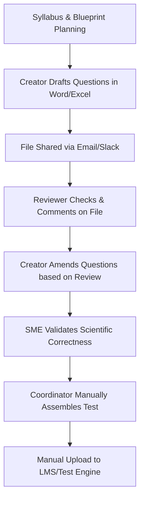

# Product Vision: QuestionBankQA

This document outlines the product vision, market need, workflow definition, and architectural core principles for **QuestionBankQA**, a commercial-grade web application designed to govern the lifecycle of high-quality assessment items.

---

## 1. Product Vision
**QuestionBankQA** is a state-of-the-art, secure, collaborative, and AI-augmented platform designed to streamline the lifecycle of academic and professional assessment items. By integrating Gemini's advanced reasoning models, QuestionBankQA empowers educational publishers, certification bodies, and schools to author, review, validate, and manage high-quality assessment assets with unprecedented efficiency and rigorous quality assurance. The platform aims to be the gold standard repository and QA tool for high-stakes test preparation and educational assessment creation.

---

## 2. Problem Statement
Creating high-stakes or even regular assessments is currently a fragmented, error-prone, and manual process. Organizations face several challenges:
- **Inconsistent Quality**: Questions often contain typos, ambiguous language, or poor distractor options (incorrect choices in MCQs) that fail to test the student's actual knowledge.
- **Taxonomy Alignment Failures**: Manually classifying questions into cognitive levels (e.g., Bloom's Taxonomy) or learning outcomes is highly subjective and frequently misaligned.
- **Fragmented Workflows**: Teams rely on emails, shared word processor files, and spreadsheets, leading to tracking issues and bottlenecks.
- **Security Vulnerabilities**: High-stakes exam items are exposed to leakage risks due to unsecured sharing methods (email attachments, public file storage).
- **Stale Content Pools**: Building fresh assessment items is slow, making it difficult to combat exam brain dumps and cheating.

---

## 3. Current Manual Workflow

Below is the typical workflow followed by most content creation teams:

1. **Syllabus & Blueprint Planning**: The curriculum coordinator defines the distribution of questions across topics and cognitive levels in a spreadsheet.
2. **Authoring**: Content creators write questions, answers, and explanations in isolated text files or spreadsheets.
3. **Sharing & Peer Review**: Files are sent via email or chat to reviewers. Feedback is written as inline comments or cell notes.
4. **Correction**: The author updates the files, incrementing file versions (e.g., `Exam_v1_final_revised2.docx`).
5. **Subject Matter Expert (SME) Validation**: The SME reviews the revised file to verify technical correctness.
6. **Compilation**: An administrator collects all approved questions and manually compiles them into a test format.
7. **LMS Integration**: Questions are manually copy-pasted or bulk-uploaded via unreliable CSV importers into a Learning Management System (LMS) or testing engine.

---

## 4. Problems in Current Workflow

| Phase | Current Pain Points | Business/Quality Impact |
| :--- | :--- | :--- |
| **Authoring** | Siloed creation, no formatting enforcement, inconsistent language style. | Increased rework time and formatting errors. |
| **Review & QA** | Loose comments, no checklist enforcement, subjective difficulty tagging. | Lower quality questions, biased cognitive tags. |
| **Security** | Documents sent via unsecure channels (email/Slack). | Leakage of high-stakes exam content. |
| **Version Control** | Multiple file versions with no clear audit trail of who changed what. | Lost work, accidental reversion to buggy drafts. |
| **Data Integrity** | Manual transfer of keys and distractors. | Double-keying errors (two correct answers marked or none). |

---

## 5. Product Goals

*   **Centralized Single Source of Truth**: A unified repository containing all assessment items, structured with JSON schema validation.
*   **AI-Augmented QA & Copilot**: Leverage Gemini API to instantly analyze readability, detect grammatical errors, suggest high-quality distractors, and verify taxonomy classification.
*   **Structured Collaborative Workflows**: Kanban-style progress tracking with mandatory validation gates (e.g., Peer Review, SME Review, QA Approval).
*   **Granular Security & Compliance**: Role-based access control (RBAC), end-to-end audit trails, and secure database architecture using Firebase.
*   **Interoperability**: One-click exports to standard formats like QTI (Question and Test Interoperability), JSON, and PDF.

---

## 6. Non-Goals

The following functions are explicitly out of scope for the MVP of QuestionBankQA:
- **Test Delivery & Proctoring**: We will not build the client-facing test player or proctoring engine. The platform's job is complete when questions are exported or synced with an LMS.
- **Grading & Analytics of Test Takers**: Tracking student scores, attendance, or learning analytics is out of scope.
- **Billing & Subscription Management**: Direct processing of student fees or pay-per-test models is out of scope.
- **Fully Autonomous Content Generation**: The AI will not write and publish tests without human intervention. Humans must always remain "in-the-loop" to verify and approve.

---

## 7. Target Users

*   **Educational Publishers**: Companies that develop textbooks and test preparation materials.
*   **Certification Bodies**: Organizations that license professionals (e.g., medical boards, IT certifiers, financial regulators).
*   **EdTech Companies**: Online schools and bootcamps requiring fresh, dynamic assessment items.
*   **K-12 & Higher Education Institutions**: Universities and school districts managing large internal question databases.

---

## 8. User Roles

We define five distinct roles with separate permissions:

1.  **Super Admin**:
    *   System configuration, subscription settings, database maintenance.
    *   Creates and provisions organizational workspaces.
2.  **Campaign Manager (Project Manager)**:
    *   Defines target goals (e.g., "Create 50 algebra questions").
    *   Assigns content creators and reviewers to campaigns.
    *   Sets workflow guidelines and review checklists.
3.  **Content Creator (Author)**:
    *   Drafts questions, distractors, solutions, and explanations.
    *   Tags questions with metadata (topics, subtopics, cognitive levels).
    *   Uses Gemini AI suggestions during authoring.
4.  **Subject Matter Expert (SME) / Reviewer**:
    *   Validates scientific/technical correctness of questions.
    *   Approves, requests changes, or rejects questions in the queue.
    *   Can override metadata/taxonomy tags.
5.  **Auditor (ReadOnly Compliance)**:
    *   Inspects the audit log and version history for security compliance.
    *   Cannot add, edit, or delete items.

---

## 9. Core Principles

*   **Human-in-the-Loop AI**: AI is a productivity accelerator and validator, not the final decision-maker.
*   **Security by Design**: Every action is authenticated, and all data transfers are secure. Question leakage must be prevented at all costs.
*   **Rigorous Data Integrity**: Strict validation schemas for every question type (e.g., an MCQ must have exactly one correct answer, 3+ distractors, and explanations for each option).
*   **Modern and Fast User Experience**: A clean, accessible, and fast interface built using Tailwind CSS and shadcn/ui.
*   **Scalability**: Built on top of Firebase App Hosting and Firestore to handle hundreds of thousands of questions and concurrent authors.

---

## 10. High-Level Features

### A. Question Workspace & Editor
*   Rich text support with Markdown and LaTeX for mathematical formulas.
*   Code syntax highlighting for computer science questions.
*   Support for multiple question formats (Multiple Choice, Multiple Response, True/False, Fill in the Blanks, Drag & Drop).

### B. Gemini-Powered AI Assistant
*   **Distractor Quality Analyzer**: Analyzes if wrong options are plausible but clearly incorrect.
*   **Cognitive Tagging**: Automatically detects Bloom's Taxonomy level (Remembering, Understanding, Applying, Analyzing, Evaluating, Creating).
*   **Readability & Bias Checker**: Scans for overly complex language, gender bias, or regional assumptions.
*   **Explanation Generator**: Generates step-by-step reasoning for correct and incorrect answers.

### C. Kanban Pipeline & Lifecycle Management
*   Visual queue tracker mapping the status of each question (`Draft` -> `In Review` -> `SME Approved` -> `QA Passed` -> `Published`).
*   Configurable review checklists before an item can change states.

### D. Version Control & History
*   Git-like version history for every question.
*   Compare differences between versions side-by-side.
*   Reversion to any previous state.

### E. Integrations & Exports
*   Export to QTI 2.1 / 3.0, JSON, CSV, and formatted PDF printouts.

---

## 11. Long-Term Vision
*   **Adaptive Testing Calibration**: Integrate with student response data to automatically adjust estimated question difficulty (Item Response Theory parameters).
*   **Automatic Syllabus Generation**: Read a textbook PDF or curriculum document and automatically output a complete blueprint of recommended questions.
*   **Translation Engine**: Translate question pools into multiple languages while preserving mathematical logic and coding syntax using specialized LLM prompts.

---

## 12. Success Criteria

- **Efficiency**: Reduce the time required to move an item from draft to published state by **50%**.
- **Quality**: Zero critical errors (e.g., incorrect answer keys, missing images) in published question exports.
- **AI Adoption**: Over **80%** of creators and reviewers utilize Gemini's AI analysis recommendations to refine questions.
- **LMS Compatibility**: 100% success rate when importing exported QTI packages into major LMS platforms (Canvas, Moodle, Blackboard).
