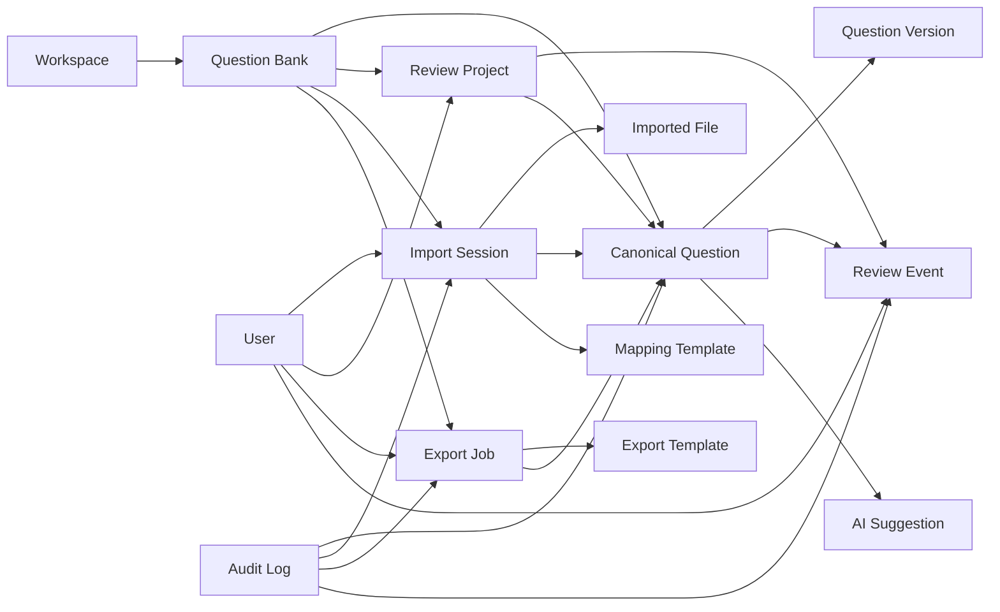
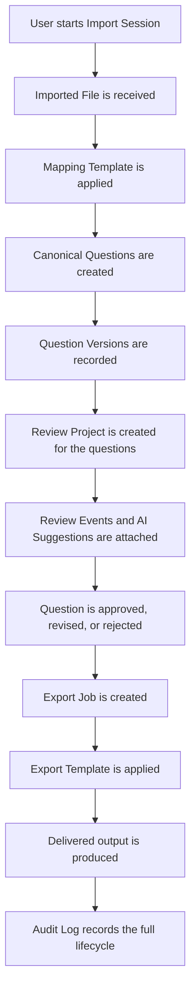

# Domain Model & Entity Relationships

This document defines the business domain for QuestionBankQA at the level of concepts, responsibilities, and relationships. It is intentionally technology-agnostic and is designed to guide future implementation decisions without tying the product to a specific database, storage model, or API structure.

The domain model complements the Canonical Question Model by answering a different question:
- The Canonical Question Model defines what a question is.
- The Domain Model defines how work is organized around that question.

---

## 1. Purpose of the Domain Model

The domain model exists to make the system’s business structure explicit before implementation begins.

It helps answer questions such as:
- What is the boundary of a project or review effort?
- How does a source file become a reviewable question set?
- How are review decisions tracked over time?
- How do templates, exports, and audit history fit into the workflow?

This model should remain stable even if the implementation changes from Firestore to another datastore, or if the UI evolves over time.

---

## 2. Core Domain Principles

### 2.1 Canonical First
All workflow entities should ultimately reference and operate through the Canonical Question Model. The business domain exists to organize work around that canonical representation.

### 2.2 Work is Organized Around Flows
The system is not merely a repository of questions. It is a workflow platform for ingesting content, reviewing it, approving it, and exporting it in a controlled way.

### 2.3 History Matters
Questions, review decisions, and exports are all historical acts. The model should preserve the lineage from source import to final output.

### 2.4 Human Review Is a First-Class Concern
Review is not an afterthought. Review Projects, Review Events, and Audit Logs are core to the domain because the platform’s value comes from disciplined, explainable quality control.

### 2.5 Templates Are Reusable Domain Assets
Mapping and export behavior should not be embedded in individual questions. Templates are reusable assets that shape how work is processed.

---

## 3. Major Business Entities

The following entities form the core business vocabulary of QuestionBankQA.

### 3.1 Workspace (optional, future multi-tenant concept)
Purpose
- Represents a top-level business container for one organization, client, or product area.

Responsibilities
- Groups related Question Banks, users, templates, and review activities.
- Provides a boundary for access control and governance in future multi-tenant or enterprise scenarios.

Key Attributes (conceptually)
- Name
- Description
- Ownership
- Status
- Organizational scope

Relationships
- Contains zero or many Question Banks.
- May contain many users and templates.

Lifecycle
- Created when an organization or business unit needs an isolated environment.
- May evolve over time as scope changes.

Ownership
- Typically owned by an administrator or organizational lead.

Note
- This entity is optional for the MVP and should be treated as a future expansion boundary rather than a mandatory dependency.

### 3.2 Question Bank
Purpose
- Represents the primary repository of questions for a given domain, initiative, or client project.

Responsibilities
- Acts as the business container for canonical questions.
- Provides a stable scope for review, organization, and export work.
- Groups questions that belong together for operational reasons.

Key Attributes (conceptually)
- Name
- Description
- Purpose or subject area
- Status
- Review policy or quality expectations

Relationships
- Belongs to a Workspace, if present.
- Contains many Canonical Questions.
- Can be associated with many Review Projects.
- May be the source for many Import Sessions and Export Jobs.

Lifecycle
- Created when a collection of questions is to be managed as a coherent body of work.
- Continues over time as questions are imported, reviewed, updated, and exported.

Ownership
- Owned by the team or organization responsible for the content pool.

### 3.3 Import Session
Purpose
- Represents a single intake operation in which one or more source files are processed into the system.

Responsibilities
- Coordinates the ingestion workflow.
- Tracks the overall import effort, including its status and outcome.
- Serves as the transaction boundary for bringing external content into the canonical domain.

Key Attributes (conceptually)
- Initiated by
- Start and end time
- Status
- Source context
- Notes or instructions

Relationships
- Creates one or more Imported Files.
- Produces one or more Canonical Questions.
- May be associated with a Mapping Template.
- May belong to a Question Bank.

Lifecycle
- Created when a new import begins.
- Moves through states such as pending, parsing, mapping, validation, completed, or failed.

Ownership
- Owned by the initiating user or team.

### 3.4 Imported File
Purpose
- Represents a single source artifact that entered the system during an import session.

Responsibilities
- Captures the original file context and its relationship to imported content.
- Preserves the source artifact as evidence for traceability and future reprocessing.
- Holds import-level metadata such as file identity, source format, and processing notes.

Key Attributes (conceptually)
- File identity
- Source format
- Original file name or reference
- Import status
- Source lineage information

Relationships
- Belongs to an Import Session.
- May contribute to many Canonical Questions.
- May be referenced by Audit Log entries.

Lifecycle
- Created when a source file is received or selected for import.
- May remain as a historical reference even after its content has been transformed.

Ownership
- Owned by the import workflow and the user initiating the session.

### 3.5 Canonical Question
Purpose
- Represents the core business object of the system: a normalized, reviewable assessment item.

Responsibilities
- Holds the canonical content and current state of the question.
- Serves as the primary subject of validation, review, AI suggestions, and export.
- Provides the stable business identity used throughout the platform.

Key Attributes (conceptually)
- Stem or prompt
- Response structure
- Correct answer representation
- Review status
- Current version
- Source lineage
- Preservation metadata

Relationships
- Belongs to a Question Bank.
- Has many Question Versions.
- May be included in one or more Review Projects.
- May receive many Review Events and AI Suggestions.
- May be exported through one or more Export Jobs.

Lifecycle
- Created by import.
- Updated through review and correction.
- May be approved, revised, rejected, or exported.

Ownership
- Owned by the owning Question Bank and the review workflow around it.

### 3.6 Question Version
Purpose
- Represents a snapshot of a question at a particular point in time.

Responsibilities
- Preserves a historical record of changes.
- Enables comparison, rollback, and auditability.
- Makes the evolution of a question explicit and reviewable.

Key Attributes (conceptually)
- Version identifier
- Timestamp
- Author or actor
- Summary of changes
- State at that version

Relationships
- Belongs to one Canonical Question.
- May be referenced by Review Events and Audit Logs.

Lifecycle
- Created whenever a question is materially changed.
- Retained as historical evidence.

Ownership
- Owned by the question’s lifecycle and the process that changed it.

### 3.7 Review Project
Purpose
- Represents a defined review effort over a selection of questions, usually focused on a specific review goal or workflow stage.

Responsibilities
- Organizes questions into a manageable review scope.
- Supports task assignment, progress tracking, and quality review outcomes.
- Provides a business boundary for one or more review rounds.

Key Attributes (conceptually)
- Name
- Review objective
- Review criteria or checklist
- Scope
- Status
- Assignees

Relationships
- Contains many Canonical Questions.
- Produces many Review Events.
- May be associated with one or more AI Suggestions.
- Belongs to a Question Bank or Workspace.

Lifecycle
- Created when a review effort is initiated.
- Moves through stages such as active review, completed review, or archived.

Ownership
- Usually owned by a reviewer, coordinator, or content manager.

### 3.8 Review Event
Purpose
- Represents a discrete review action or observation.

Responsibilities
- Records what happened during review.
- Captures decisions, comments, manual corrections, approvals, and rejections.
- Preserves the human reasoning trail that supports explainability and governance.

Key Attributes (conceptually)
- Type of event
- Actor
- Timestamp
- Comment or decision
- Outcome

Relationships
- Belongs to a Canonical Question.
- May belong to a Review Project.
- May be connected to one or more AI Suggestions.

Lifecycle
- Created whenever a reviewer or system action occurs.
- Remains as part of the question’s review history.

Ownership
- Owned by the reviewer or the workflow system.

### 3.9 Mapping Template
Purpose
- Defines how external source data should be interpreted and translated into the canonical representation.

Responsibilities
- Encodes reusable mapping knowledge for import workflows.
- Enables repeatable import behavior for recurring source formats.
- Supports configuration-driven import rather than hardcoded logic.

Key Attributes (conceptually)
- Name
- Version
- Scope or source format
- Mapping rules or configuration
- Description

Relationships
- Used by many Import Sessions.
- May be associated with one or more Imported Files.
- Supports the transformation from external content into Canonical Questions.

Lifecycle
- Created when a mapping approach is defined or refined.
- Versioned as the import logic evolves.

Ownership
- Owned by the platform or a domain administrator responsible for import configuration.

### 3.10 Export Template
Purpose
- Defines how canonical questions should be formatted or structured when exported back to an external target format.

Responsibilities
- Preserves layout fidelity and field mapping for exports.
- Enables repeatable export behavior without hardcoding per client rules.

Key Attributes (conceptually)
- Name
- Version
- Target format or layout
- Mapping rules or formatting configuration

Relationships
- Used by many Export Jobs.
- Works in tandem with Canonical Questions and preserved metadata.

Lifecycle
- Created or refined when a target output format is defined.
- Versioned for compatibility and future reuse.

Ownership
- Owned by the platform or an export configuration steward.

### 3.11 Export Job
Purpose
- Represents a single execution of export work for a selected set of questions.

Responsibilities
- Coordinates the export process from the canonical domain into an external artifact.
- Tracks the export’s status and delivery outcome.
- Produces the deliverable that is shared with a client or downstream system.

Key Attributes (conceptually)
- Target output
- Scope of included questions
- Status
- Timestamp
- Result reference

Relationships
- Uses an Export Template.
- Operates over many Canonical Questions.
- May be linked to Review Projects or Question Banks.

Lifecycle
- Created when an export is requested.
- Moves through states such as queued, generating, completed, or failed.

Ownership
- Owned by the user or team requesting the export.

### 3.12 AI Suggestion
Purpose
- Represents an AI-generated insight related to a question or review process.

Responsibilities
- Flags potential issues, suggests corrections, or offers classifications.
- Enhances the review workflow without overriding human judgment.
- Supports explainability through confidence and reasoning.

Key Attributes (conceptually)
- Type of suggestion
- Confidence
- Reasoning
- Proposed action or value
- Timestamp

Relationships
- Related to one or more Canonical Questions.
- May be attached to Review Events or Review Projects.
- Must remain distinct from human-approved values.

Lifecycle
- Created during review or analysis.
- May be accepted, rejected, or superseded by a human review event.

Ownership
- Owned by the AI-assisted workflow, but always interpreted through human review.

### 3.13 User
Purpose
- Represents a person participating in the platform’s workflows.

Responsibilities
- Initiates, reviews, approves, or manages work.
- Acts as the principal actor behind content changes and review decisions.

Key Attributes (conceptually)
- Identity
- Role
- Permissions
- Team or organization association

Relationships
- Creates or owns Import Sessions, Review Projects, Export Jobs, and Review Events.
- Interacts with Question Banks and Workspaces.

Lifecycle
- Exists as a long-lived identity within the system.

Ownership
- Owned by the organization or platform environment.

### 3.14 Audit Log
Purpose
- Represents the immutable or append-only history of significant domain events.

Responsibilities
- Records who did what, when, and why.
- Supports compliance, traceability, and troubleshooting.
- Helps preserve the integrity of the review and export process.

Key Attributes (conceptually)
- Event type
- Actor
- Timestamp
- Associated subject
- Summary of change

Relationships
- May reference many domain entities, including Questions, Review Events, Import Sessions, Export Jobs, and Users.

Lifecycle
- Appended over time.
- Retained as historical evidence.

Ownership
- Owned by the platform governance layer rather than any single business actor.

---

## 4. Entity Relationship Diagram

---

## 5. Workflow: How a Question Moves Through the System

The following workflow shows how the domain entities cooperate.

This workflow shows that the domain is not simply about storing questions. It is about governing a lifecycle from ingestion to review to delivery.

---

## 6. Aggregate Roots

From a Domain-Driven Design perspective, the following are strong candidates for aggregate roots:

### 6.1 Question Bank
The Question Bank is the primary aggregate root for question content and its associated workflow scope.

Why it matters:
- It acts as the stable container for canonical questions.
- It is the natural boundary for review and export operations.
- It prevents orphaned questions and scattered ownership boundaries.

### 6.2 Review Project
The Review Project is an aggregate root for review-related coordination.

Why it matters:
- It governs a bounded set of work with explicit review goals.
- It collects review events and review progress into one coherent unit.

### 6.3 Import Session
The Import Session is an aggregate root for ingestion operations.

Why it matters:
- It coordinates source files, mapping logic, and created questions.
- It is the boundary for a single import transaction.

### 6.4 Export Job
The Export Job is an aggregate root for export execution.

Why it matters:
- It orchestrates the generation of a deliverable from a selected set of questions.
- It has a clear lifecycle and outcome.

### 6.5 Workspace (optional)
The Workspace can act as an aggregate root in enterprise-style multi-tenant scenarios.

Why it matters:
- It provides a top-level boundary for all work in a business context.
- It is useful when multiple clients or organizational units need separation.

---

## 7. Long-Lived vs. Transient Entities

### Long-Lived Entities
These are business concepts that should persist across many operations and remain part of the system’s history.
- Workspace
- Question Bank
- Canonical Question
- Question Version
- Review Project
- User
- Mapping Template
- Export Template
- Audit Log

### Transient or Workflow-Oriented Entities
These are usually created to support a specific operation and may have shorter lifespans.
- Import Session
- Imported File
- Review Event
- AI Suggestion
- Export Job

This distinction is useful because it tells us which entities should be considered durable business records and which are operational artifacts.

---

## 8. Architectural Decisions This Model Implies

The following architectural decisions should be treated as important guidance for future implementation:

### 8.1 The Canonical Question Is the Core Business Identity
The system should not treat questions as temporary rows or import artifacts. They are durable business objects that carry history, review state, and export relevance.

### 8.2 Review and Export Are First-Class Workflows
Review projects and export jobs are not secondary concerns. They are core domain capabilities and should be modeled as first-class business entities, not as incidental UI states.

### 8.3 Templates Are Reusable Domain Assets
Mapping and export templates should be modeled as durable configuration assets, not as one-off import logic embedded in the UI or database layer.

### 8.4 Auditability Is a Core Requirement
The system should preserve a reliable record of significant events because the product’s credibility depends on being able to explain what happened and when.

### 8.5 Work Should Be Organized Around Scopes, Not Only Individual Questions
A Question Bank or Review Project provides the necessary scope to make the system usable for large-scale, multi-step review work.

---

## 9. Recommended Implementation Guidance

For future implementation, the domain model suggests the following design posture:
- Build around durable business entities first, not around storage tables.
- Keep the Canonical Question and Question Version at the center of the domain.
- Treat review and export as explicit workflows with their own lifecycle states.
- Preserve source lineage and review history as first-class responsibilities.
- Keep templates configurable and reusable rather than baked into the codebase.

This domain model should be considered the business foundation for the next architecture phase, especially before any storage or collection design work is undertaken.
