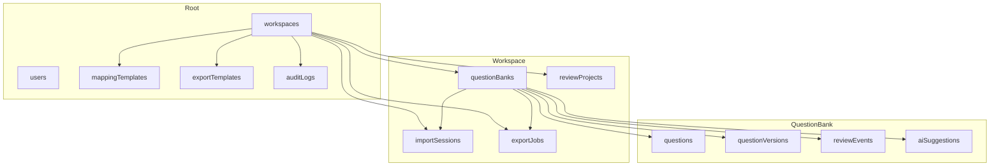

# Firestore Storage Architecture

This document proposes a Firestore storage architecture for QuestionBankQA that is aligned with the approved Canonical Question Model and the Domain Model. It is intended as a design artifact for future implementation and does not prescribe application code or TypeScript models.

The guiding assumption is that Firestore should preserve the product’s business boundaries rather than simply mirror the UI screens or the import/export pipeline. The storage design therefore emphasizes:
- canonical-first data ownership
- clear workflow boundaries
- auditability and review history
- extensibility for custom metadata
- scalability for large question sets

---

## 1. Storage Design Principles

### 1.1 Preserve the Canonical First Boundary
The canonical question is the core business object. Firestore should store the canonical representation as the authoritative record, while workflow entities reference it rather than replacing it.

### 1.2 Keep Business Aggregates Cohesive
Each business aggregate should be stored as a coherent unit with its own lifecycle, permissions, and update boundaries. This reduces cross-document churn and makes the system easier to reason about.

### 1.3 Prefer Flexible, Map-Based Structures
Because question types and client metadata vary, Firestore documents should avoid rigid tabular assumptions. A flexible metadata map is preferred for extensible attributes, preserved unknown fields, and future question types.

### 1.4 Separate Durable State from Operational State
Long-lived business records such as question banks, canonical questions, review projects, and templates should be stored as durable documents. Short-lived workflow artifacts such as import sessions and export jobs may be represented as smaller, status-driven documents that are easier to update and archive.

### 1.5 Make History Explicit
Version history and audit history should be first-class storage concerns. They should not be inferred from ad hoc updates or UI logs.

### 1.6 Use Storage for Large Binary Assets
Large source files such as Excel workbooks should not be stored directly in Firestore documents. They should be uploaded to Firebase Storage, while Firestore stores the metadata and lineage information.

---

## 2. Proposed Collection Hierarchy

The following hierarchy is proposed as the conceptual Firestore structure.

This structure reflects the idea that a question bank is the main business container for canonical questions and the review/export workflows that operate on them.

---

## 3. Subcollection Strategy

### 3.1 Core Business Aggregates as Primary Documents
The most important entities should be modeled as rich documents with their own subcollections:
- question banks
- canonical questions
- review projects
- import sessions
- export jobs

### 3.2 Subcollections Under Question Banks
A question bank should contain the following subcollections:
- questions
- reviewProjects
- importSessions
- exportJobs
- auditLogs

This keeps question-bank-scoped content together and makes it easier to apply security rules, query by scope, and manage lifecycle operations.

### 3.3 Subcollections Under Questions
Each canonical question should own its own subcollections:
- versions
- reviewEvents
- aiSuggestions

This makes the question a self-contained aggregate with its own history and review trail.

### 3.4 Why This Works Well for Firestore
Firestore performs best when a document tree reflects a natural business boundary. The question bank and question aggregates are strong natural boundaries for the product’s workflow.

---

## 4. Document Ownership

### 4.1 Ownership by Aggregate Root
The main ownership boundaries should be:
- Workspace owns question banks, templates, and shared governance artifacts.
- Question Bank owns canonical questions, review projects, imports, and exports that belong to that bank.
- Canonical Question owns its version history, review events, and AI suggestions.
- Import Session owns the import workflow state and the source file references.
- Export Job owns the export workflow state and output references.

### 4.2 Ownership Rules
- A document should have one primary owner or parent aggregate.
- Cross-aggregate references should be lightweight and should not create ambiguous ownership.
- Workflow artifacts should not outlive their parent aggregate without a clear archival strategy.

---

## 5. Entity-to-Collection Mapping

| Domain Entity | Suggested Firestore Storage Shape | Notes |
| --- | --- | --- |
| Workspace | Top-level workspace document | Optional for future multi-tenant use |
| Question Bank | Top-level or workspace-scoped document | Best treated as a durable aggregate root |
| Import Session | Workspace- or question-bank-scoped document | Short-lived workflow document |
| Imported File | Subcollection under import session or top-level document with parent reference | Prefer subcollection for lifecycle clarity |
| Canonical Question | Question-bank-scoped document | Core business entity |
| Question Version | Subcollection under canonical question | Immutable or append-only history |
| Review Project | Question-bank-scoped document | Durable review scope |
| Review Event | Subcollection under question or review project | Append-only review history |
| Mapping Template | Top-level or workspace-scoped document | Durable configuration artifact |
| Export Template | Top-level or workspace-scoped document | Durable export configuration |
| Export Job | Question-bank-scoped document | Workflow artifact with status |
| AI Suggestion | Subcollection under question or review project | Derived insight, not authoritative state |
| User | Top-level user document or profile document | Keeps user identity separate from business content |
| Audit Log | Top-level or workspace-scoped collection | Append-only, cross-entity history |

---

## 6. Embedded vs Referenced Data

### 6.1 Embed When
Embed data when it is:
- frequently read together with the parent document
- small and stable
- part of the immediate working state
- unlikely to change independently

Examples:
- a question’s current review metadata may be embedded in the canonical question document
- a short summary of the owning question bank may be embedded in a review project document
- a user’s display name may be embedded in an audit entry for faster display

### 6.2 Reference When
Reference data when it is:
- large or grows over time
- updated independently
- shared across many documents
- better treated as its own aggregate

Examples:
- question versions should be referenced by the question document but stored in a separate subcollection
- review events should be stored separately because they are append-only and can be queried independently
- import sessions should be separate from questions because they represent an operational workflow, not the canonical business content itself

### 6.3 Recommended Rule of Thumb
- Embed summary data that is needed for fast UI rendering.
- Reference authoritative or historical data that should remain independently managed.
- Avoid embedding large arrays of review events or version snapshots directly into the main question document.

---

## 7. Read and Write Patterns

### 7.1 Read Patterns
The UI will likely need to read the following shapes frequently:
- list of question banks for a workspace
- list of questions in a question bank with status filters
- one question with its current metadata and latest review state
- review queue for a review project
- history of a question
- import session status and progress
- export job status and result references

### 7.2 Write Patterns
The system should write in the following patterns:
- create a new question bank once per project or client scope
- create or update a Canonical Question as the central content operation
- add a new Question Version whenever content changes materially
- append Review Events as review decisions occur
- write AI Suggestions as derived metadata without mutating authoritative values
- update review project progress as questions move through states
- create a new export job when export is requested
- append an audit entry for each materially significant action

### 7.3 Recommended Pattern
The write path should preserve the parent aggregate as the transaction boundary. In most cases, writes should update the question document and add a new version and audit entry, rather than scattering the state across unrelated collections.

---

## 8. Query Patterns Expected by the UI

The UI is likely to depend on the following Firestore query patterns.

### 8.1 Question Bank Listing
- Query question banks by workspace or owner
- Order by updatedAt or createdAt

### 8.2 Question Review Queue
- Query questions in a question bank by status
- Filter by review project, assignee, or quality flags
- Sort by updatedAt or priority

### 8.3 Question Detail View
- Read the current canonical question document
- Read recent review events and latest version summary
- Read AI suggestions associated with the question

### 8.4 Import Progress View
- Read the active import session document
- Read imported files and import status summaries
- Read progress counters or status maps

### 8.5 Export Progress View
- Read the export job document
- Read job status and output references

### 8.6 Audit Trails
- Query audit logs by related entity or time range
- Filter by actor, event type, or target entity

These query patterns argue for keeping commonly queried fields indexed and denormalized where necessary.

---

## 9. Recommended Composite Indexes

The following index families are likely to be beneficial.

### 9.1 Questions
- questionBankId + status + updatedAt
- questionBankId + reviewProjectId + status
- questionBankId + assigneeId + status
- questionBankId + importedFromSessionId + status

### 9.2 Review Projects
- questionBankId + status + updatedAt
- ownerId + status

### 9.3 Import Sessions
- questionBankId + status + createdAt
- ownerId + status

### 9.4 Export Jobs
- questionBankId + status + createdAt
- ownerId + status

### 9.5 Audit Logs
- targetEntityId + createdAt
- actorId + createdAt
- workspaceId + createdAt

These indexes should be reviewed as the UI workflows mature, but the above list should cover the most likely read paths.

---

## 10. Security Boundary Considerations

Firestore security should mirror the domain boundaries.

### 10.1 Workspace-Level Isolation
If workspaces are used, security rules should restrict access by workspace membership. Users should not be able to read documents from another workspace unless explicitly authorized.

### 10.2 Question Bank Ownership
Question bank documents and their subcollections should be readable or writable only by users with the appropriate permission level.

### 10.3 Review-Scoped Access
Review projects may need to expose a narrower set of documents to reviewers than to administrators. The security model should support role-based access rather than relying on a single broad rule.

### 10.4 Audit Log Write Protection
Audit logs should be append-only from the application’s point of view. Users should not be able to delete or modify audit records directly.

### 10.5 Template Governance
Templates should be restricted to authorized users, especially if they influence import/export mappings and therefore affect data fidelity.

---

## 11. Audit Logging Strategy

Audit logging should be treated as an architectural requirement, not a UI convenience.

### 11.1 Append-Only Event Stream
Every significant business event should create an audit entry, including:
- import started or completed
- question created or updated
- review event recorded
- question approved or rejected
- export requested or completed
- mapping template changed
- version created

### 11.2 Audit Record Shape
Each audit entry should include:
- actor
- timestamp
- event type
- target entity reference
- summary of the change
- optional context or reason

### 11.3 Storage Placement
A dedicated audit log collection is recommended, with documents referencing the related entities. This keeps audit history queryable and avoids bloating the primary entity documents.

### 11.4 Why This Is Important
This strengthens trust, supports compliance, and provides the historical trail that the product’s manual workflow lacked.

---

## 12. Version Storage Strategy

### 12.1 A Question Owns Its History
Each canonical question should own a subcollection of versions. This reflects the business reality that a question evolves over time.

### 12.2 Store Full Snapshots or Deltas
A practical compromise is to store:
- a compact version summary in the version document
- a full snapshot of the canonical content for traceability

This avoids forcing the UI to reconstruct prior states from tiny incremental deltas while still keeping the model understandable.

### 12.3 Why This Is Better Than Overloading the Main Document
The main question document should remain the current live state. The version subcollection should preserve the history. This separation makes reads faster and history clearer.

---

## 13. Large File Storage Approach Using Firebase Storage

Excel files and other large source artifacts should be stored in Firebase Storage rather than Firestore.

### 13.1 Recommended Pattern
- Upload the source file to Firebase Storage.
- Store a metadata document in Firestore that references the storage object and contains the import context.
- Preserve the storage path, file size, checksum, mime type, and source lineage.

### 13.2 Why Storage Is Better Than Firestore for Large Files
Firestore is optimized for structured documents rather than large binary payloads. Firebase Storage is the right place for workbooks and other large uploaded files.

### 13.3 Metadata Document Relationship
The imported file metadata document should point to the storage object and be owned by the import session or the question bank depending on the workflow design.

---

## 14. Firestore Transaction Boundaries

Because Firestore transactions are limited and should be kept small, the most important transaction boundaries are:

### 14.1 Creating a Question from an Import
A transaction should create or update the canonical question, add a version record, and write the initial audit entry. This ensures that the canonical state and its first history entry remain consistent.

### 14.2 Completing a Review Decision
A review action should atomically update the parent question’s state, append a review event, and update the review project summary if needed.

### 14.3 Starting or Completing an Export Job
An export operation should create the job document, update the related question set state, and write an audit entry without leaving the workflow in a partially updated state.

### 14.4 Why Transaction Boundaries Matter
They prevent half-applied workflow state, such as a question being marked approved without the corresponding review event being recorded.

---

## 15. Scalability Considerations

### 15.1 Use Aggregates, Not Global Collections for Everything
A large global collection of questions can become difficult to manage. Grouping questions under question banks provides a clear and scalable partitioning strategy.

### 15.2 Keep Documents Reasonably Sized
The canonical question document should remain focused on the current state and a small set of metadata. Large arrays of historical data or embedded full review histories should be avoided.

### 15.3 Use Subcollections for Growth-Prone Data
Version history, review events, and AI suggestions naturally grow over time. These should live in subcollections rather than inside the main document.

### 15.4 Separate Operational Workflows from Core Content
Import sessions, review projects, and export jobs should not be mixed into the canonical question documents. They are operational and should be managed as their own workflow aggregates.

### 15.5 Plan for Future Partitioning
If the platform grows substantially, the model can be extended with additional scoping or partitioning, while preserving the same business boundaries.

---

## 16. Offline and Synchronization Considerations

### 16.1 Firestore Supports Local Writes Well
The review workflow can benefit from Firestore’s ability to queue writes locally, especially for reviewers who may have unstable connectivity.

### 16.2 Design for Eventual Consistency
The system should assume that changes may be observed slightly later, particularly in multi-user review scenarios.

### 16.3 Avoid Conflict-Heavy Updates on the Same Document
If multiple users edit the same question closely together, the update strategy should be explicit. A review event append pattern is safer than trying to merge large, mutable fields in place.

### 16.4 Offline-First Guidance
The most important offline-friendly pattern is to treat review actions and audit entries as append operations, not as fragile in-place merges of the whole question document.

---

## 17. Trade-Offs and Rationale

### 17.1 Why Not Store Everything in One Giant Question Collection?
A single global question collection would simplify some lookup patterns, but it would make security, ownership, and lifecycle management harder. Organization by question bank is more aligned with the domain model and more scalable.

### 17.2 Why Use Subcollections for Versions and Events?
These are growth-prone entities with their own lifecycle. Keeping them in subcollections avoids making the core question document too large and keeps history readable and queryable.

### 17.3 Why Keep Import and Export Workflows Separate?
Import sessions and export jobs are operational artifacts, not canonical content. Storing them as separate workflow aggregates reduces coupling and makes the system easier to reason about during long-running processes.

### 17.4 Why Use a Separate Audit Log Collection?
Audit logs are append-only and cross-cutting. A dedicated collection makes them easier to protect, query, and retain without overloading primary business documents.

### 17.5 Why Use Firebase Storage for Large Files?
Because Excel workbooks and other source files are binary assets, Firebase Storage is more suitable than Firestore for storage and retrieval.

---

## 18. Recommended Storage Direction

The proposed architecture favors a model where:
- the question bank is the primary organizational boundary
- the canonical question is the primary content aggregate
- version history, review history, and audit history are stored as first-class subcollections or collections
- import/export workflows are modeled as separate workflow aggregates
- large files live in Firebase Storage with Firestore metadata references

This approach preserves the Canonical First philosophy while remaining practical for Firestore’s document model.

---

## 19. Decisions Worth Reviewing Before Implementation

The following decisions should be explicitly reviewed before implementation begins:

1. Whether question banks should be the primary parent for questions and workflow artifacts, or whether a workspace should be the only top-level boundary.
2. Whether review projects should be modeled as independent aggregates or as lightweight scopes attached to a question bank.
3. Whether all audit events should be stored in one shared collection or partitioned by workspace and aggregate type.
4. Whether version snapshots should be full document copies or a hybrid of summary plus full snapshot.
5. Whether question-level AI suggestions should be stored under the question aggregate or under the review project aggregate.
6. Whether the import session should own the imported file metadata directly or delegate that responsibility to a separate file document.

These are important architectural choices because they affect read performance, write complexity, and the long-term maintainability of the system.

---

## Summary

The proposed Firestore architecture keeps the business domain at the center of the data model:
- canonical questions remain the authoritative content objects
- workflow entities such as import sessions, review projects, and export jobs remain separate and explicit
- history and auditability are preserved as first-class concerns
- file storage is separated from document storage for scalability
- the model is extensible without forcing rigid schemas

This design should be considered a strong foundation for the next implementation stage, especially before Firestore collections, indexes, and security rules are finalized.
