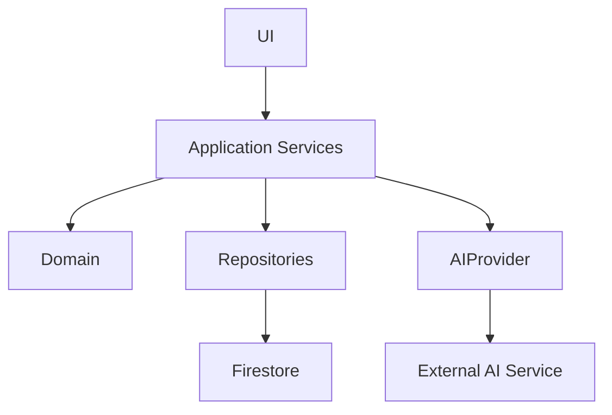

# ADR-001: Overall System Architecture

## Status

Draft

## Version

0.1

## Context

Question Bank QA Platform is an AI-assisted question processing system designed for multiple organizations. The platform supports reusable template profiles, AI-assisted schema mapping, and end-to-end workflows for import, review, and export.

The product must accommodate diverse customer formats while maintaining one internal representation for downstream processing. It must also support rapid evolution of AI capabilities without coupling core business logic to a specific AI vendor.

## Problem Statement

How should the application be architected to remain modular, maintainable, testable, and extensible as the platform grows in workflow complexity, integration surfaces, and AI-assisted capabilities?

## Decision

The platform will adopt the following architecture decisions:

- Feature-based architecture.
- Domain-first design.
- Repository pattern for persistence boundaries.
- Service layer for orchestration and business use cases.
- AI abstraction through `AIProvider`.
- Canonical Question Model as the internal source of truth.
- Schema Mapping Engine as the central translation layer.
- Separation between Domain, Infrastructure, and UI.

## Architectural Principles

- Single Responsibility: Each module should have one clear reason to change.
- Dependency Inversion: High-level modules depend on abstractions, not concretions.
- Composition over Inheritance: Runtime behavior is assembled via composition.
- AI behind interfaces: AI interactions are isolated through provider contracts.
- Canonical First: Internal processing uses canonical structures.
- User Approval before execution: AI suggestions require explicit human approval before becoming active mappings.

## High Level Architecture

## Benefits

This architecture supports growth by isolating change across layers and enforcing clear boundaries:

- Faster feature delivery through feature-oriented module ownership.
- Improved testability via repository and provider abstractions.
- Safer AI evolution by replacing provider implementations without changing domain workflows.
- Better maintainability through canonical-first processing and schema translation centralization.
- Extensibility for new connectors and formats without redesigning core domain logic.

## Consequences

Positive consequences:

- High modularity and explicit boundaries.
- Reduced coupling between UI, domain logic, persistence, and AI vendors.
- Clear seams for unit and integration testing.
- Better long-term adaptability for new workflows and integrations.

Negative consequences:

- Additional abstraction layers increase initial implementation overhead.
- More interfaces and service contracts require stronger governance and documentation discipline.
- Potential duplication risk if feature boundaries are not consistently enforced.
- Slight runtime and cognitive overhead from indirection across layers.

## Related Documents

- ADR-003 Mapping Engine.
- [docs/design/Schema-Mapping-Engine.md](docs/design/Schema-Mapping-Engine.md).
