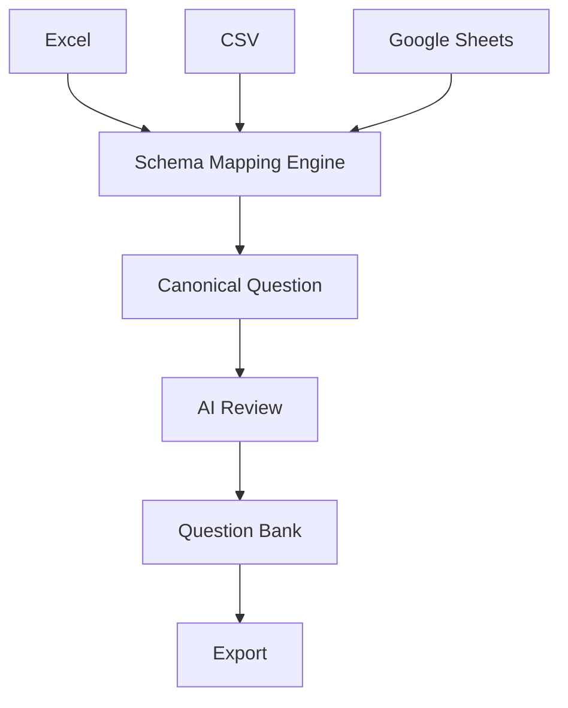

# ADR-002: Canonical Question Model

## Status

Draft

## Version

0.1

## Context

Organizations use different spreadsheet formats to represent question content. In practice, source files vary in structure, naming, ordering, and optional columns across customers and projects.

## Problem

How can the application process questions consistently despite different customer schemas?

## Decision

The application owns one Canonical Question Model as its internal representation for question processing.

- Every import converts external schema data into the canonical model.
- Every export converts canonical data into the required external schema.

The canonical model is the internal source of truth for downstream processing workflows.

## Principles

- One internal representation.
- External schemas remain external.
- AI assists only during mapping.
- Canonical objects never store customer-specific column names.

## Benefits

- Simpler business logic through uniform internal structures.
- Easier testing with deterministic, schema-independent domain fixtures.
- Easier analytics because reporting targets one stable data shape.
- Easier AI review because AI workflows consume consistent canonical fields.
- Easier export because format-specific translation occurs at the boundary.

## Alternatives Considered

### Store every customer's schema directly (Rejected)

This alternative would make external variability leak into core workflows. Business logic, review logic, analytics, and export code would need per-schema condition branches, increasing complexity and defect risk. Testing costs would rise as every feature would need matrix coverage across customer-specific schema variants.

### Separate model per organization (Rejected)

This alternative would reduce reuse across tenants and duplicate core domain logic. It would complicate maintenance, increase migration overhead, and make cross-organization feature rollout slower and riskier. It also weakens long-term consistency for AI-assisted workflows and analytics.

## Future Evolution

The Canonical Question Model enables future import and export formats by isolating variability at translation boundaries. New connectors such as CSV, Google Sheets, REST payloads, and XML can be supported by mapping into and out of the same canonical shape, without rewriting core domain processing.

## Summary

The Canonical Question Model is central to the platform architecture because it stabilizes internal processing while allowing external format flexibility. By translating at boundaries and processing internally in one model, the application remains modular, maintainable, and extensible as new organizations, formats, and AI-assisted capabilities are added.

## Canonical Flow

