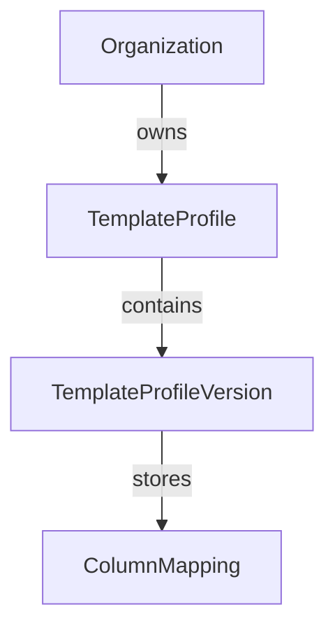

# ADR-005: TemplateProfileVersion

Status: Accepted

Date: 2026-07-30

Decision Makers: Product Owner, Architecture

Supersedes: None

Superseded By: None

## Purpose

A TemplateProfileVersion represents an immutable, versioned snapshot of an approved template structure.

It preserves the exact mapping configuration that was approved at a specific point in time, enabling historical traceability, deterministic template recognition, and safe reuse across future imports.

## Responsibilities

A TemplateProfileVersion is responsible for:

- Store approved ColumnMappings.
- Store the template fingerprint.
- Store the version number within a TemplateProfile.
- Store audit information (creator and creation timestamp).
- Act as an immutable historical record.

## Version Creation Rules

When an uploaded workbook mapping is approved:

1. Generate a fingerprint for the approved mapping structure.
2. Search existing versions under the target `TemplateProfile`.
3. If the fingerprint already exists, reuse that existing version.
4. Otherwise, create the next version automatically.

Version numbers are assigned sequentially within a TemplateProfile.

Versions are created automatically by the system after successful user approval.

Users never create, edit, or manage version numbers manually.

## Fingerprint

Fingerprints are generated by a dedicated `TemplateFingerprintService`.

`TemplateProfileVersion` stores the fingerprint value but does not generate it. This keeps fingerprint computation concerns separate from version domain state.

Fingerprints uniquely identify the structure of a template rather than the workbook file itself.

## Immutability

Once created, a TemplateProfileVersion cannot be modified.

Changes to the template structure always result in the creation of a new version rather than updating an existing one.

This guarantees auditability and reproducible import behavior.

## Relationships

## Out of Scope

This design intentionally does not include:

- AI confidence.
- Similarity scoring.
- Workbook file storage.
- Repository logic.
- Firestore schema details.
- UI behavior.
- Template recognition algorithms.
- Fingerprint generation.

These concerns belong to other layers or documents.

## Status

Accepted.

This decision is considered frozen.

Future changes require a new ADR or a documented amendment if implementation reveals a genuine architectural issue.
