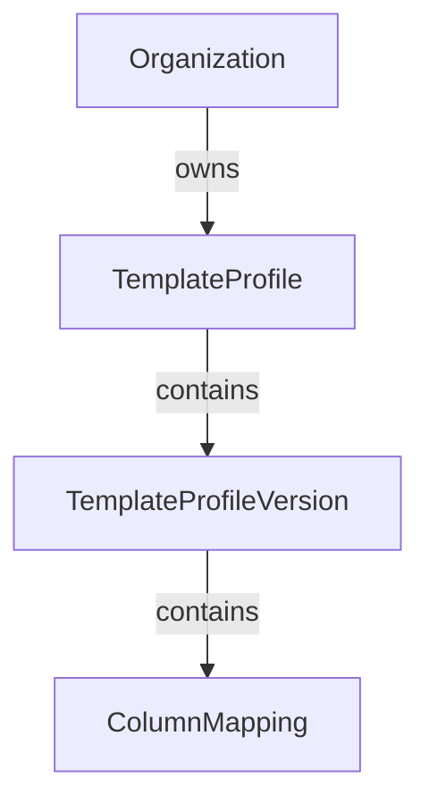

# ADR-006: TemplateProfile

Status: Proposed

Date: 2026-07-30

Decision Makers: Product Owner, Architecture

Supersedes: None

Superseded By: None

## Purpose

A TemplateProfile represents the logical identity of a reusable template within an organization.

It groups multiple immutable TemplateProfileVersions that represent the evolution of the same template over time.

A TemplateProfile does not store mappings or fingerprints directly.

## Responsibilities

A TemplateProfile is responsible for:

- Identifying a logical template.
- Belonging to a single Organization.
- Maintaining a human-readable template name.
- Grouping TemplateProfileVersions.
- Managing the collection of TemplateProfileVersions.
- Acting as the root of a template version lineage.

## What It Does Not Do

A TemplateProfile is not responsible for:

- Column mappings.
- Fingerprint generation.
- Fingerprint matching.
- AI suggestions.
- Version comparison.
- Template detection.

These responsibilities belong to dedicated services or child entities.

## Relationships

## Version Management

A TemplateProfile owns one or more TemplateProfileVersions.

Each version is immutable.

New template structures create new versions.

Existing fingerprints reuse existing versions.

## Lifecycle

A TemplateProfile is created when the system identifies a completely new logical template that does not belong to any existing TemplateProfile.

Once created:

- It receives a human-readable name.
- It initially contains one TemplateProfileVersion.
- Additional TemplateProfileVersions may be added over time.
- The TemplateProfile itself is never versioned.

## Naming

Each TemplateProfile has a human-readable name.

Examples include:

- Moodle Export
- Blackboard Question Bank
- Biology Final Assessment

Names are intended for users and administrators.

Template recognition is performed using fingerprints rather than profile names.

## Out of Scope

This ADR intentionally excludes:

- Import processing.
- Workbook parsing.
- Repository implementation.
- Firestore persistence.
- AI integration.
- Fingerprint algorithms.

## Status

Status: Accepted

This architecture decision is frozen.

Future changes require a new ADR or a documented architectural amendment.
