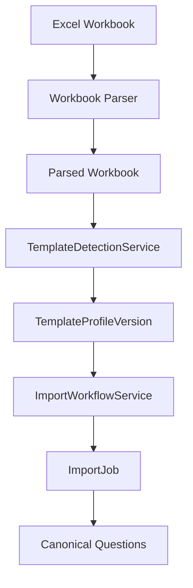

# ADR-007: ImportJob

Status: DESIGN FROZEN

Date: 2026-07-30

Decision Makers: Product Owner, Architecture

Supersedes: None

Superseded By: None

## Purpose

An ImportJob represents the complete state and lifecycle of a single workbook import.

It acts as the authoritative record of an import execution, capturing business progress, business outcomes, and audit information.

ImportJob records business state only.

ImportJob does not orchestrate parsing, template detection, or import execution.

The orchestration of the import process is performed by application services (for example ImportWorkflowService) rather than the ImportJob itself.

## Responsibilities

An ImportJob is responsible for:

- Identifying a single import execution.
- Recording the importing user.
- Recording uploaded workbook metadata reference.
- Tracking workflow status.
- Recording timestamps.
- Recording the TemplateProfileVersion used during the import.
- Recording import metrics including:
    - Questions imported
    - Questions skipped
    - Warnings
    - Errors
    - Duration
- Recording warnings and errors.
- Acting as the audit record for the entire import.

ImportJob responsibilities are limited to recording business state.

ImportJob does not execute workbook parsing, template detection, or question import orchestration.

These behaviors belong to application services (for example ImportWorkflowService).

## Aggregate Boundary

ImportJob is responsible only for business state.

ImportJob owns:

- Import lifecycle status
- Audit information
- TemplateProfileVersion used for the import
- ImportStatistics
- Business warnings
- Business errors

ImportJob does not own technical artifacts.

Examples include:

- Uploaded workbook bytes
- File streams
- Apache POI Workbook objects
- Parsed worksheet rows
- Parsed spreadsheet cells
- Temporary AI mapping suggestions
- HTTP requests
- REST DTOs
- Infrastructure objects

These artifacts belong to the application and infrastructure layers and are transient during processing.

## Composition

ImportJob contains an immutable ImportStatistics value object.

ImportStatistics represents the outcome of an import.

It groups related statistics such as:

- Questions imported
- Questions skipped
- Warning count
- Error count
- Processing duration

ImportStatistics is a Value Object because:

- it has no identity
- it is immutable
- it represents a descriptive snapshot

## Lifecycle

The lifecycle of an ImportJob is:

Created
    ↓
Parsing
    ↓
Template Detection
    ↓
Awaiting User Approval
    ↓
Importing
    ↓
Completed

If an unrecoverable error occurs:

Failed

## Status

The ImportJob status values are:

- Created
- Parsing
- DetectingTemplate
- AwaitingUserApproval
- ImportingQuestions
- Completed
- Failed

Status transitions must always move forward.

Completed and Failed are terminal states.

## Relationships

```mermaid
flowchart TD
    User --> ImportJob
    ImportJob --> Uploaded Workbook Metadata
    ImportJob --> TemplateProfileVersion
    ImportJob --> CanonicalQuestion
```

Logical workflow flow:



ImportJob only stores business information generated by the workflow.

## Outcomes

Every ImportJob ends in exactly one terminal state:

- Completed
- Failed

Future terminal states (such as Cancelled) require a new architecture decision.

## Audit Information

An ImportJob records:

- createdAt
- startedAt
- completedAt
- createdBy

These values provide complete traceability for every import.

## Out of Scope

This ADR intentionally excludes:

- Excel parsing implementation.
- AI prompt generation.
- LLM interaction.
- Firestore persistence.
- Repository implementation.
- UI workflow.
- Background job execution.

## Design Principles

- One workbook upload creates exactly one ImportJob.
- An ImportJob is never reused.
- ImportJobs are immutable after completion except for audit enrichment.
- Historical ImportJobs must remain available for reporting and troubleshooting.
- ImportJob remains intentionally small.
- Technical processing data is never persisted inside the aggregate.
- The aggregate records outcomes, not processing details.
- Business state is separated from technical execution.

## Future Extensions

Future ADRs may introduce:

- Import cancellation
- Retry support
- Progress tracking
- Import history dashboards

These enhancements should extend ImportJob without violating the aggregate boundary defined in this ADR.

## Status

Status: DESIGN FROZEN

This architecture decision is frozen.

Future changes require a new ADR or a documented architectural amendment.
