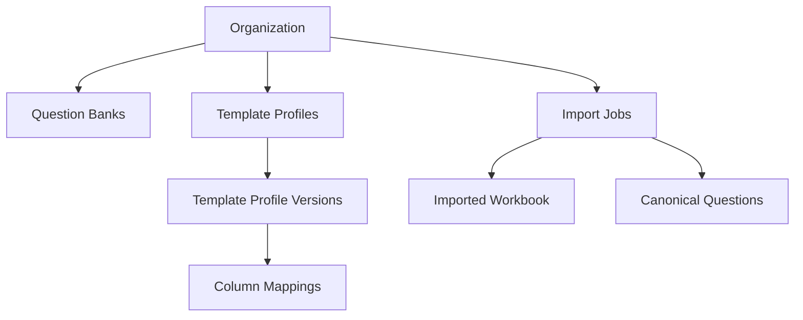
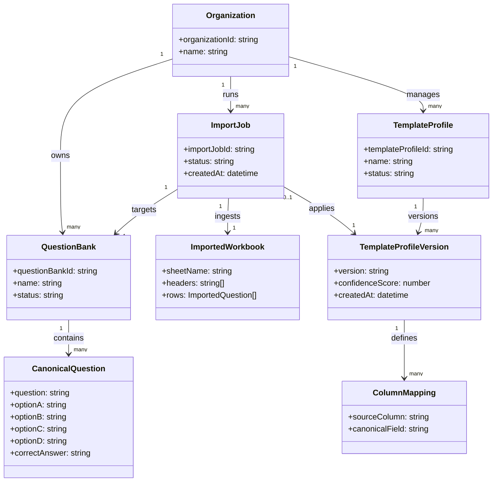

# Schema Mapping Engine

- Status: Draft
- Version: 0.1
- Last Updated: 2026-07-30
- Related ADRs: ADR-003: Mapping Engine

## Overview

The Schema Mapping Engine is the core translation layer that bridges external data schemas and the application's Canonical Question Model. Organizations often manage assessment content in different spreadsheet layouts and naming conventions. The platform standardizes those variations by translating incoming and outgoing data through one canonical representation.

This design enables the product to support multiple external schemas (Excel, CSV, Google Sheets, and others) without fragmenting internal data structures or business logic.

## Terminology

| Term | Meaning |
| --- | --- |
| External Schema | Customer-specific data structure from Excel, CSV, Google Sheets, or another source. |
| Canonical Model | Internal standard representation used by the application for questions and related workflows. |
| Mapping | Translation definition between an external schema and canonical fields. |
| Template Profile | Reusable, approved schema mapping definition for an organization. |
| Mapping Suggestion | AI-generated mapping proposal that requires user review and approval. |

## Design Philosophy

The platform owns one Canonical Question Model that represents the application's source of truth for question content. External schemas are treated as integration surfaces rather than internal data models.

Organizations may continue using their preferred formats. The Schema Mapping Engine translates between those external formats and the canonical model in both directions:

- Import: external schema -> canonical model
- Export: canonical model -> external schema

By centralizing translation in one engine, the system improves consistency, reduces duplicate logic, and provides a stable foundation for future connectors.

## Guiding Principles

- Canonical First: Internal workflows, validation, review, and analytics operate on canonical objects.
- AI Suggests: AI proposes mappings between external columns and canonical fields.
- User Approves: Final mapping decisions require explicit user confirmation.
- Reuse Existing Template Profiles: Previously approved profiles should be reused whenever possible.
- Transparency: Mapping decisions and profile versions should be understandable and traceable.
- Preserve Customer Data: Unmapped and customer-specific fields should be preserved for round-trip fidelity.
- Shared Engine for Import and Export: One mapping engine supports both ingestion and delivery pathways.

## Key Design Decisions

- One Canonical Model: All internal workflows depend on a single canonical question representation.
- Multiple Template Profiles per Organization: Each organization may maintain multiple approved profiles for different source templates.
- Immutable Template Profile Versions: Approved mapping states are captured as immutable versions for traceability.
- Human Approval Required: Mapping suggestions do not become active until explicitly approved by a user.

## Non-Goals

The Schema Mapping Engine is not responsible for:

- Parsing Excel files.
- AI prompt generation.
- Firestore persistence.
- UI rendering.
- Question validation.

## Domain Objects

| Domain Object | Responsibility |
| --- | --- |
| Organization | Tenant boundary and ownership context for mappings, jobs, and question banks. |
| QuestionBank | Durable container of canonical questions within an organization scope. |
| ImportedWorkbook | Snapshot of data read from an external workbook before canonical conversion. |
| ImportJob | Operational unit that tracks one import attempt and its processing state. |
| TemplateProfile | Reusable schema mapping definition for a given external template shape. |
| TemplateProfileVersion | Immutable version of a template profile used for traceability and rollback. |
| MappingSuggestion | AI-generated candidate mappings proposed for user review. |
| ColumnMapping | Field-level mapping from external columns to canonical fields (plus pass-through metadata). |
| CanonicalQuestion | Internal standardized question representation used by all downstream workflows. |

## Responsibilities

### Organization

- Purpose: Defines tenant scope and governance boundary.
- Owner: Platform administration and tenant administrators.
- Contains: Question banks, template profiles, import jobs.
- Does Not Contain: Field-level mapping logic, parser implementation details.

### QuestionBank

- Purpose: Stores canonical questions for a defined content domain.
- Owner: Content teams within an organization.
- Contains: Canonical questions and their lifecycle metadata.
- Does Not Contain: External schema definitions or raw workbook parsing details.

### ImportedWorkbook

- Purpose: Represents exactly what was read from an external file.
- Owner: Import workflow pipeline.
- Contains: Sheet identity, headers, raw imported rows in normalized import shape.
- Does Not Contain: Approved mappings, canonical persistence strategy.

### ImportJob

- Purpose: Tracks execution state, outcomes, and diagnostics for one import run.
- Owner: Import orchestration layer.
- Contains: Job status, references to workbook input and selected template profile version.
- Does Not Contain: Canonical business rules or UI behavior.

### TemplateProfile

- Purpose: Reusable mapping contract for a customer template family.
- Owner: Organization content operations.
- Contains: Logical mapping identity and version lineage.
- Does Not Contain: Raw AI response payloads as source of truth.

### TemplateProfileVersion

- Purpose: Immutable snapshot of approved mappings at a point in time.
- Owner: Mapping governance process.
- Contains: Column mappings, unmapped columns, confidence context, version metadata.
- Does Not Contain: Runtime job state or parser implementation behavior.

### MappingSuggestion

- Purpose: Captures AI-proposed mapping candidates for human review.
- Owner: AI-assisted mapping workflow.
- Contains: Suggested field mappings, confidence indicators, optional reasoning.
- Does Not Contain: Final approval authority.

### ColumnMapping

- Purpose: Defines how one external column maps to canonical field semantics.
- Owner: Approved template profile version.
- Contains: External column name, canonical target field, mapping intent metadata.
- Does Not Contain: Canonical question content values.

### CanonicalQuestion

- Purpose: Single normalized representation for question processing.
- Owner: Question bank domain.
- Contains: Question text, options, answer key, explanation, metadata/custom fields.
- Does Not Contain: External template-specific column naming assumptions.

## Relationships

### Conceptual View

### Structural View

## Mapping Lifecycle

The mapping lifecycle explicitly separates AI suggestions from approved mapping artifacts.

## Future Evolution

The design intentionally decouples external connectors from canonical data semantics. New formats can be added by implementing additional ingestion and extraction adapters that feed the same mapping engine and canonical pipeline.

Examples include:

- CSV adapters that produce ImportedWorkbook-compatible structures.
- Google Sheets connectors that materialize equivalent header/row payloads.
- REST API adapters that map partner payloads into external-schema abstractions.
- XML translators that convert element structures into mappable columns/fields.
- Additional enterprise connectors that reuse the same TemplateProfile and versioning model.

Because the Canonical Question Model remains stable, these extensions should not require changes to core canonical objects or downstream review/export workflows.

## Out of Scope

This document intentionally does not define:

- Firestore collection design.
- API endpoint contracts.
- UI implementation details.
- Service-level implementation details.
- AI prompt engineering content.

## Summary

The Schema Mapping Engine is the central translation layer that enables schema flexibility at the edges while preserving one internal Canonical Question Model. Organizations can retain their own spreadsheet conventions, while the platform maintains consistency for processing, review, and export.

AI improves speed by proposing mappings, but users remain responsible for approving final mappings. This human-in-the-loop model ensures control, traceability, and data fidelity while supporting long-term extensibility across new external formats.

## Open Questions

- How should the system determine that an uploaded workbook matches an existing template profile?
- When should the system create a new template profile versus a new template profile version?
- Should template profiles be archived, versioned only, or support both lifecycle mechanisms?
